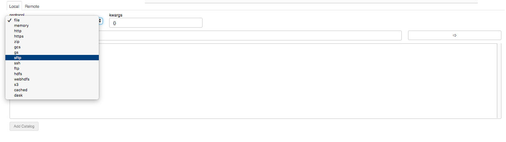

# Generalised File Systems

Originally created for the needs of [Dask](http://dask.pydata.org),
we have spun out a general
file system implementation and specification, to provide all users
with simple access to many local, cluster and remove storage media.
Dask and Intake have moved to use this new package: `fsspec`,
and it will be at the core of data access in Anaconda Enterprise.

 ## Introduction
 
For context, we are talking about the low-level business of getting
raw bytes from some location. We are used to doing that on a local disc,
but communicating with other storage mechanisms can be tricky, and
certainly *different* in every case. For example consider, how you
would go about reading some file from HDFS, from some server you have SSH
credentials for, or some cloud service like AWS S3? Since these are
important to answer when dealing with big data, we developed code to
complement Dask just for the job, and released packages like `s3fs`
and `gcsfs`.

We found that those packages, which were built and released standalone,
because popular even without Dask, partly because they were being used
by other pydata libraries such as `pandas` and `xarray`. So we realised
that the general idea or dealing with arbitrary file systems, as well as
helpful code to map URLs to bytes, should not be buried in Dask, but should
be made open and available to everyone, even if they are not interested
in parallel/out-of-core computing. We therefore released 
[`fsspec`](https://github.com/intake/filesystem_spec/) and rebased the
other projects to use it.

## Examples
 
Consider the following lines of code
 
 ```python
>>> import fsspec
>>> of = fsspec.open("s3://anaconda-public-datasets/iris/iris.csv", mode='rt', anon=True)
>>> with of as f:
...     print(f.readline())
...     print(f.readline())
5.1,3.5,1.4,0.2,Iris-setosa
4.9,3.0,1.4,0.2,Iris-setosa
```

This parsed a URL and initiates a session to talk with AWS S3, to read a particular
key in text mode. Note that we specify that this is an *anonymous* connection (for
those that don't have S3 credentials, since this data is public). The object
`of` is a serialisable `OpenFile`, which only communicated with the remote service
within a context; but `f` is a regular file-like object which can be passed to
many python functions expecting to use methods like `readline()`. The output is
two lines of data from the famous Iris Dataset.

It is worth noting that the file is random access, if in uncompressed bytes mode; this
means that you can access smaller parts of massive files without having to download the
whole thing, something which is crucial to big data processing locally or in the cloud,
the kind of situation in which Dask shines.

Now compare with the following:

```python
>>> of = fsspec.open("https://datahub.io/machine-learning/iris/r/iris.csv")
>>> with of as f:
...     print(f.readline())
...     print(f.readline())
...     print(f.readline())
sepallength,sepalwidth,petallength,petalwidth,class
5.1,3.5,1.4,0.2,Iris-setosa
4.9,3.0,1.4,0.2,Iris-setosa
```

This uses a different backed for HTTP locations, but has *exactly the same
API*. This version of the data happens to include the header line.

Alternatively, you can work with file system instances, which have all of the
methods that you would expect, inspired by the builtin `os` module:

```python
>>> fs = fsspec.filesystem('s3', anon=True)
>>> fs.ls('anaconda-public-datasets')
['anaconda-public-datasets/enron-email',
 'anaconda-public-datasets/fashion-mnist',
 'anaconda-public-datasets/gdelt',
 'anaconda-public-datasets/iris',
 'anaconda-public-datasets/nyc-taxi',
 'anaconda-public-datasets/reddit']
>>> fs.info("anaconda-public-datasets/iris/iris.csv")
{'Key': 'anaconda-public-datasets/iris/iris.csv',
 'LastModified': datetime.datetime(2017, 8, 10, 16, 35, 36, tzinfo=tzutc()),
 'ETag': '"f47788bbfca239ad319aa7a3b038fc71"',
 'Size': 4700,
 'StorageClass': 'STANDARD',
 'type': 'file',
 'size': 4700,
 'name': 'anaconda-public-datasets/iris/iris.csv'}
```

The point is, you do (almost) exactly the same thing for any of the several
[backend file systems](https://github.com/intake/filesystem_spec/blob/master/fsspec/registry.py#L10),
and you get the benefit of extra features for free:

- transparent decompression and text mode
- key-value dictionary views of directories
- transactional writing
- and [many more](https://filesystem-spec.readthedocs.io/en/latest/index.html#highlights)

## Unified interface

[Intake](https://intake.readthedocs.io) now depends on `fsspec` for its file handling. 
Intake's purpose is to ease the process of finding and loading data, so being able to
browse any file system (or anything that can be thought of as a file system) is important.
In the main GUI, you can now select amongst many possible backends, not just local files:



This allows you to select catalogs that may be remote, and have them load remote data too.
Of course, you still need to have the relevant driver installed, and indeed to have access
to a service matching the protocol (the `kwargs` box exists to add any additional parameters
that the backend may need). For example, in the following image, I can browse S3, and see
all of the buckets that I am an owner of as "directories". This requires no extra configuration,
since my S3 credentials are stored on the system.


## The spec

A more subtle point, is that a lot of the logic for how to deal with files is common across
implementations. The `fsspec` package contains a spec for other file system implementations
to derive from, making the process of writing new file system wrappers - which will be
compatible with Dask, Intake, and others - a much simpler process. Such implementations will
also inherit many of the for-free features.

Therefore, I invite all interested developers to get in touch to see how you might go about
implementing your favourite file system.
